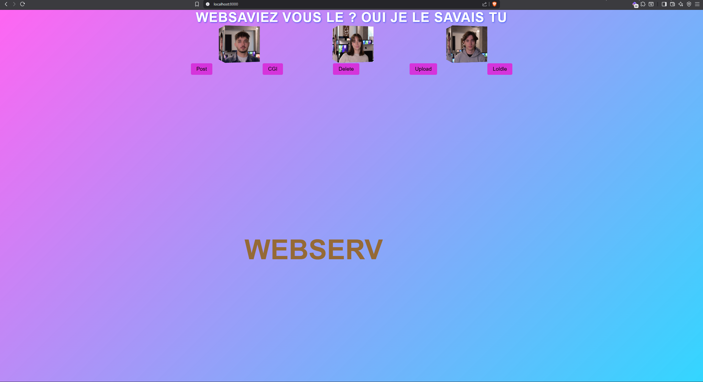

# Webserv

> A lightweight HTTP/1.1-compliant web server written in C++98 from scratch.

## Table of Contents

- [About](#about)
- [Features](#features)
- [Getting Started](#getting-started)
- [Usage](#usage)
- [Configuration](#configuration)
- [Project Structure](#project-structure)
- [Examples](#examples)
- [Authors](#authors)
- [License](#license)

## About

**Webserv** is an event-driven HTTP server implemented in C++98.  
It was developed as part of the advanced system programming curriculum at [42 School](https://42.fr), with the goal of reproducing the functionality of production-grade web servers like Nginx or Apache.

Objectives:

- Gain practical experience with network programming
- Understand event-driven architectures using `poll()`
- Implement a custom configuration parser
- Handle multiple clients and servers concurrently

## Features

- HTTP/1.1 support (`GET`, `POST`, `DELETE`)
- Non-blocking I/O using `poll()`
- Custom configuration format
- Virtual hosts and multiple ports
- Static file serving with auto-index
- CGI support (e.g., Python, PHP)
- Custom error pages
- Chunked transfer encoding
- Connection timeout and socket reuse

## Getting Started

### Requirements

- Linux or macOS
- `g++` compiler with C++98 support
- `make`
  
## Screenshots

### Homepage Example

